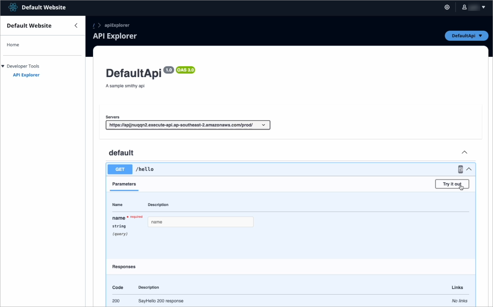
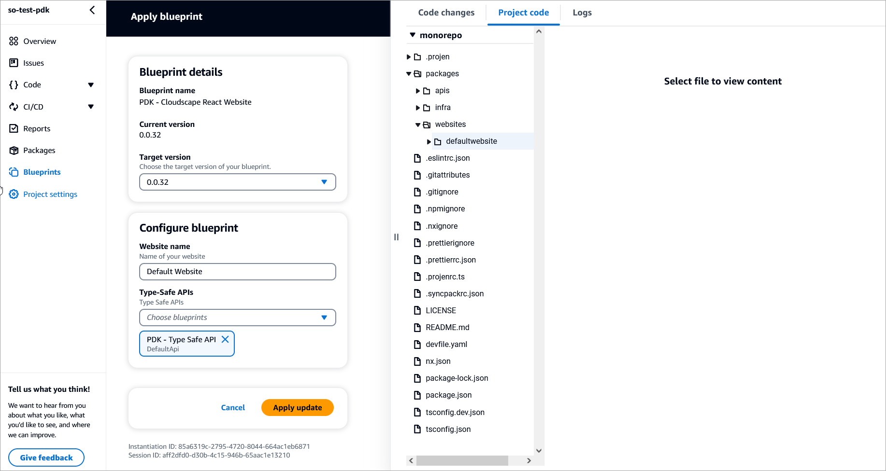

# About this blueprint

This blueprint creates a Cloudscape/React Single Page Application (SPA) with pre-configured integration (optional) with a Type Safe API using constructs found in the AWS Project Development Kit ([AWS PDK](https://aws.github.io/aws-pdk/)).

For example, this is a website generated in CodeCatalyst using PDK blueprints.


## How does it work?

This blueprint generates a website for the PDK monorepo so that you can associate an optional parameter (Type Safe APIs blueprint) to automatically configure your website to set up an API Explorer which will allow you to make `sigv4` signed requests for your configured Type Safe API(s).

## Prerequisites

Ensure that you have an existing PDK Monorepo project.

## Apply and configure the blueprint

1. Navigate to the PDK Monorepo project, and from the left, select **Blueprints**.
2. On the Blueprints page, click **Apply blueprint**. The Apply blueprint page displays.
3. From the CodeCatalyst blueprints page, select **PDK - Cloudscape React Website** and click **Next**.
4. Complete the following:
    - Select the **target version** for your blueprint. While this is optional, we recommend using the latest version.
    - Enter a **name** for your website.
    - From the Type-Safe APIs dropdown, select the **API blueprint** you want to integrate within the website. For example, PDK - Type Safe API, if it exists.
    
5. Click **Apply blueprint** to apply the Cloudscape React Website blueprint to your monorepo project. CodeCatalyst will automatically create a pull request.
6. Merge the pending pull request to apply the blueprint. A new `packages/website` folder is added which contains all the source code for your new website.

## Project resources

This blueprint creates the following key files and folders as part of your project.

```text
.projen/   
    deps.json     -- installed dependencies
    files.json
    tasks.json
.public/   
    index.html    -- installed dependencies
    robots.txt
.src/
    components/ - generated documentation in the formats you specified
        Auth/   -- only generated if an API is selected
        RuntimeContext/  -- only generated if an API is selected
        TypeSafeApiClientProvider/  -- only generated if an API is selected
    hooks/
    layouts/
        App/
        Routes/
    pages/
        ApiExplorer/ -- only generated if an API is selected
        Home/
    config.json
    index.tsx
    react-app-env.d.ts
    setupTests.ts
```

## Additional resources

For additional information about using the website, refer to the [PDK Developer Guide](https://aws.github.io/aws-pdk/developer_guides/cloudscape-react-ts-website/index.html).