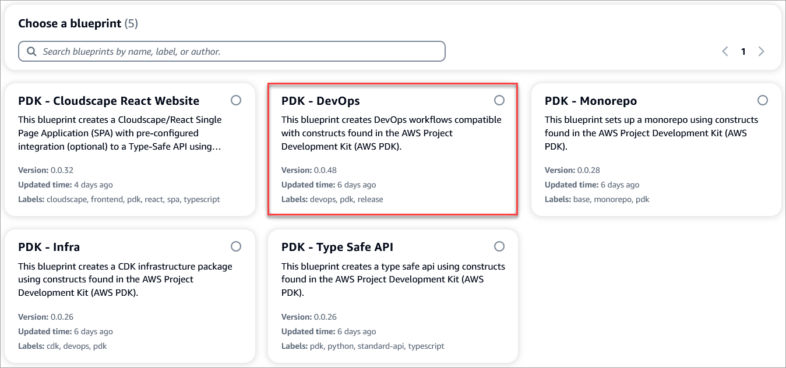
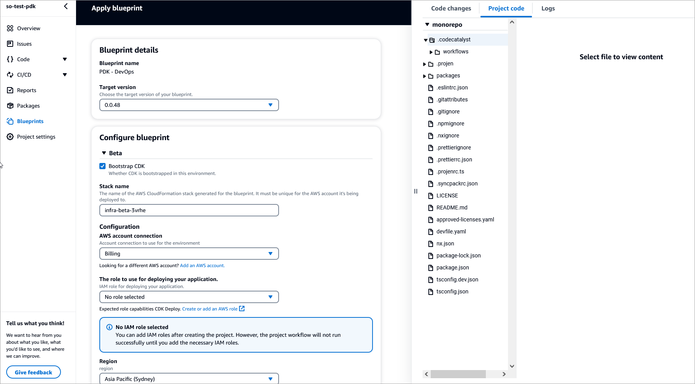

# About this blueprint

This blueprint creates DevOps workflows compatible with constructs found in the ([AWS PDK](https://aws.github.io/aws-pdk/)).

## How does it work?

This blueprint generates the required DevOps workflows for pull requests, releases and deployment of your project, using the AWS account and role specified in the configuration.

## Set up the blueprint

1. From the Projects page, select **PDK - Monorepo**. The monorepo project summary page displays.
2. On the page, from the left, select **Blueprints**.
3. On the Blueprints page, click **Apply blueprint**. The Apply blueprint page displays.
4. From the CodeCatalyst blueprints page, select **PDK - DevOps** and click **Next**.

5. Complete the following:
    - Select the target version for your blueprint. You can select a specific version from the dropdown.
    - Choose to bootstrap CDK in the current environment.
    - Enter a name for your AWS CloudFormation stack.
    - From the AWS account connection dropdown, select the AWS account to be used for the resources.
    - From the role dropdown, select the IAM role to be used for deploying your project application.
    - Select the region where you want to deploy your monorepo project.
    
6. Click **Apply blueprint** to apply the Infra blueprint to your monorepo project. A new `codecatalyst/workflows` folder is created within your monorepo project.

## Project resources

This blueprint creates the following key files and folders as part of your project.

```
.codecatalyst/   
    workflows/
        pr.yaml       --_TODO: Describe_
        release.yaml  --_TODO: Describe_
```