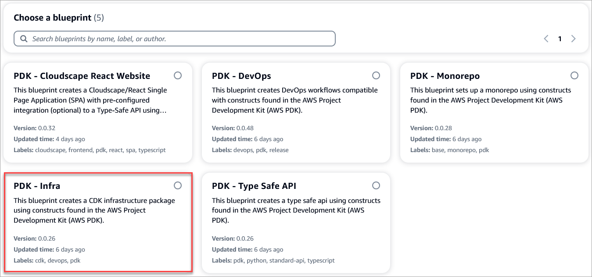
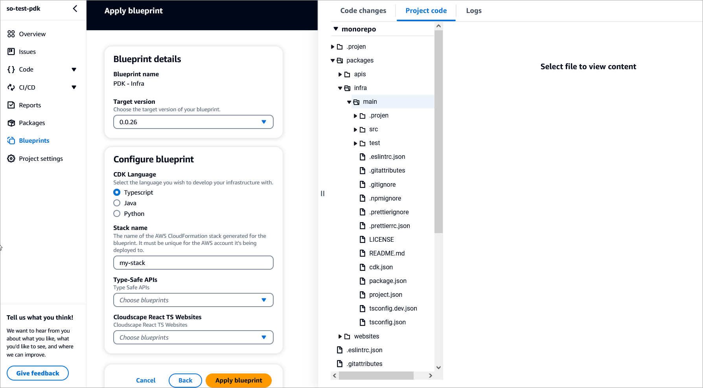

# About this blueprint

This blueprint sets up the infrastructure to deploy your project components into the AWS cloud, using a CDK infrastructure package from constructs in the AWS Project Development Kit ([AWS PDK](https://aws.github.io/aws-pdk/)).

## How does it work?

The blueprint sets up a folder containing all of your pre-configured CDK code to deploy your website and API. You can specify the Type Safe API and website to be configured for the monorepo project.

## Prerequisites

Ensure that you have set up a PDK monorepo project, and applied the Type Safe API and Cloudscape React Website blueprints to the monorepo project.

## Set up the blueprint

1. From the Projects page, select **PDK - Monorepo**. The monorepo project summary page displays.
2. On the page, from the left, select **Blueprints**.
3. On the Blueprints page, click **Apply blueprint**. The Apply blueprint page displays.
4. From the CodeCatalyst blueprints page, select **PDK - Infra** and click **Next**.

5. Complete the following:
    - Select the **target version** for your blueprint. You can select a specific version from the dropdown.
    - Select the **primary language** you want to develop your project code in. You can select from Typescript, Java, or Python.
    - Enter a **name** for your AWS CloudFormation stack.
    - From the Type-Safe APIs dropdown, select the **API blueprint** you want to integrate within the website. For example, PDK - Type Safe API.
    - From the Cloudscape React TS websites dropdown, select the **website** blueprint you want to deploy with your infrastructure. For example, PDK - Cloudscape React Website.
    
6. Click **Apply blueprint** to apply the Infra blueprint to your monorepo project. A new `packages/infra` folder is created within your monorepo project which contains the infrastructure that will deploy your project into the AWS cloud.

## Project resources

This blueprint creates the following key files as part of your project.

```text
infra/
    main/
        .projen/   
            deps.json     -- installed dependencies
            files.json    
            tasks.json    
        .src/   
            constructs/   -- installed dependencies
                apis/
                websites/
            stacks/
            test/
        .eslintrc.json    
        .gitattributes    
        .gitignore        
        .npmignore        
        .nxignore         
        .prettierignore   
        .prettierrc.json  
        .projenrc.ts      -- where your packages are defined
        LICENCE           
        README.md         
        cdk.json          
        package.json      -- dependency declarations (managed by projen)
        project.json      
        tsconfig.dev.json
        tsconfig.json     
```

## Additional resources

For additional information about using the infrastructure features and resources, refer to the [PDK Developer Guide](https://aws.github.io/aws-pdk/developer_guides/infrastructure/index.html).