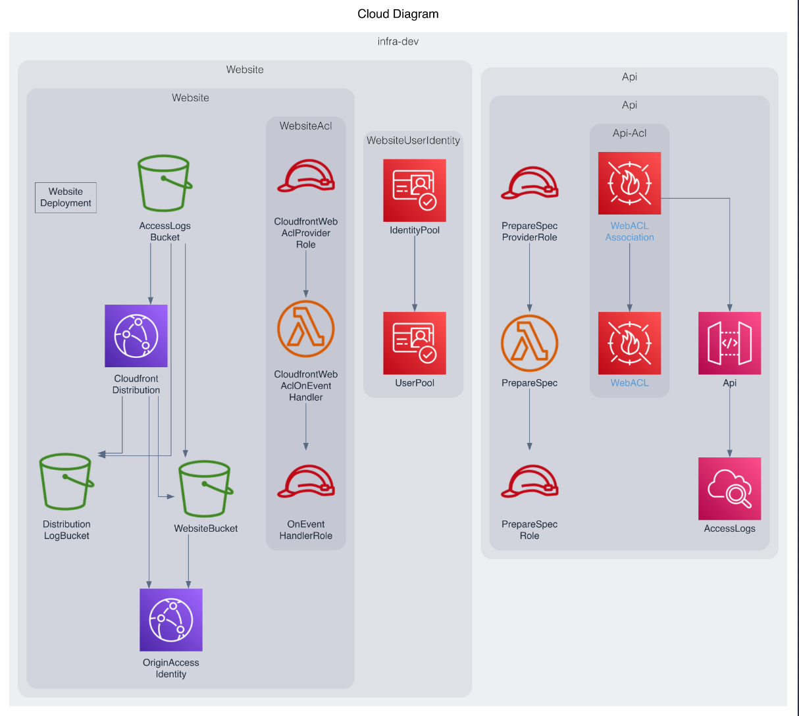

# About this blueprint

This blueprint sets up a monorepo using the constructs from the AWS Project Development Kit ([AWS PDK](https://aws.github.io/aws-pdk/)), which provides building blocks for common patterns together with development tools to manage and build your projects.

!!!note
    This blueprint only generates the building blocks of the project. To use the blueprint, you will need to apply other PDK blueprints such as Type Safe API, Website, Infra or DevOps to create a working application.

You can define your projects programatically using one of these three type safe languages: Typescript, Python or Java.

## Architecture overview

_TODO: Describe the PDK monorepo architecture with diagram_

After you have generated a PDK monorepo project, and applied all relevant blueprints (A{I, Website, Infra, and DevOps) to the project, the generated project will include the following architectural components.



## How does it work?

The blueprint sets up a root project as a monorepo using [NX](https://nx.dev/getting-started/intro), and manages all of the NX configuration for you by default. Depending on the language you decide to bootstrap your project with, a `projenrc` file in your preferred language allows you to add new sub-packages (using blueprints) to your project to be managed by NX.

## Project resources

This blueprint creates the following key files as part of your project.

_TODO: Check this for PDK blueprints across languages_

```
.projen/   
    deps.json     -- installed dependencies
    files.json    --_TODO: Describe_
    tasks.json    --_TODO: Describe_
.eslintrc.json    --_TODO: Describe_
.gitattributes    --_TODO: Describe_
.gitignore        --_TODO: Describe_
.npmignore        --_TODO: Describe_
.nxignore         --_TODO: Describe_
.prettierignore   --_TODO: Describe_
.prettierrc.json  --_TODO: Describe_
.projenrc.ts      -- where your packages are defined
.syncpackrc.json  --_TODO: Describe_
LICENCE           --_TODO: Describe_
README.md         --_TODO: Describe_
devfile.yaml      --_TODO: Describe_
nx.json           -- nx config (this file is managed by projen)
package.json      -- dependency declarations (managed by projen)
tsconfig.dev.json --_TODO: Describe_
tsconfig.json     --_TODO: Describe_
```

## Additional resources

For additional information about using the monorepo features and resources, refer to the [PDK Developer Guide](https://aws.github.io/aws-pdk/developer_guides/monorepo/index.html).