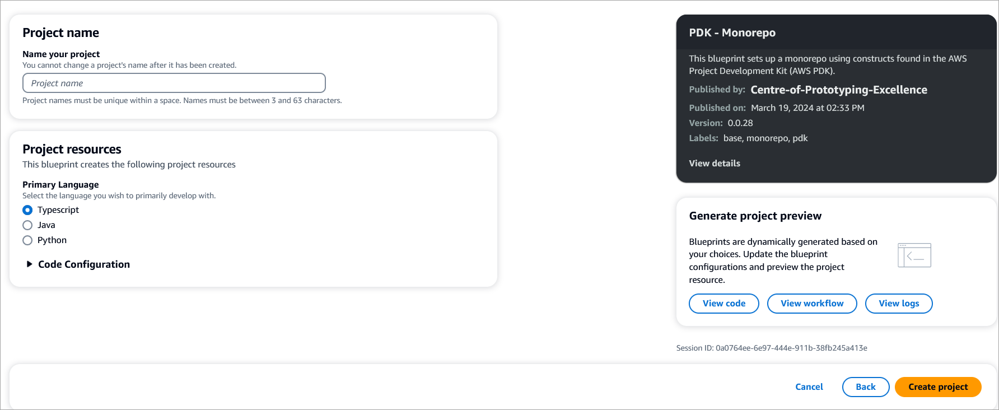

# About this blueprint

This blueprint sets up a monorepo project using the constructs from the AWS Project Development Kit ([AWS PDK](https://aws.github.io/aws-pdk/)), which provides building blocks for common patterns together with development tools to manage and build your projects.

You can define your projects programatically using one of these three type safe languages: Typescript, Python or Java.

## PDK Blueprint ecosystem

After you have generated a Monorepo project, you can these additional PDK blueprints to the project:
- [Type Safe API](/blueprints/type-safe-api/README.md): Add API capabilities to your Monorepo project.
- [Cloudscape React Website](/blueprints/cloudscape-react-website/README.md): Generate a website for the Monorepo so that you can make authenticated API calls.
- [Infra](/blueprints/infra/README.md): Pre-configured CDK code to deploy your website and API
- [DevOps](/blueprints/devops/README.md): Generate the required DevOps workflows for pull requests, releases and deployment of your project

## How does it work?

The blueprint sets up a root project as a monorepo using [NX](https://nx.dev/getting-started/intro), and manages all of the NX configuration for you by default. Depending on the language you bootstrap your project with, a `projenrc` file (in your preferred language) allows you to add new sub-package, using blueprints to your project.

## Set up the blueprint

1. From the CodeCatalyst blueprints page, select **PDK - Monorepo** and click **Next**. The **Create Project** page displays.

2. On the page, complete the following:
    - **Project name**: Enter a name for your project.
    - **Primary language**: Select the language you want to develop your project code in. You can select from Typescript, Java, or Python.
    - Under Code Configuration, select the Package Manager and source repository for your project.
3. Click **Create project** to create your monorepo project. This will create the root level project that manages interdependencies between projects within the monorepo, provides build caching and dependency visualization.

    !!!note
        This blueprint only generates the building blocks of the project. To create a workable website using the blueprint, you will need to add other PDK blueprints such as Type Safe API, Website, Infra or DevOps to create a working application.

## Project resources

This blueprint creates the following key files as part of your project.

```text
.projen/   
    deps.json     -- installed dependencies
    files.json    
    tasks.json    
.eslintrc.json    
.gitattributes    
.gitignore        
.npmignore        
.nxignore         
.prettierignore   
.prettierrc.json  
.projenrc.ts      -- where your packages are defined
.syncpackrc.json  
LICENCE           
README.md         
devfile.yaml      
nx.json           -- nx config (this file is managed by projen)
package.json      -- dependency declarations (managed by projen)
tsconfig.dev.json 
tsconfig.json
```

## Additional resources

For additional information about using the monorepo features and resources, refer to the [PDK Developer Guide](https://aws.github.io/aws-pdk/developer_guides/monorepo/index.html).