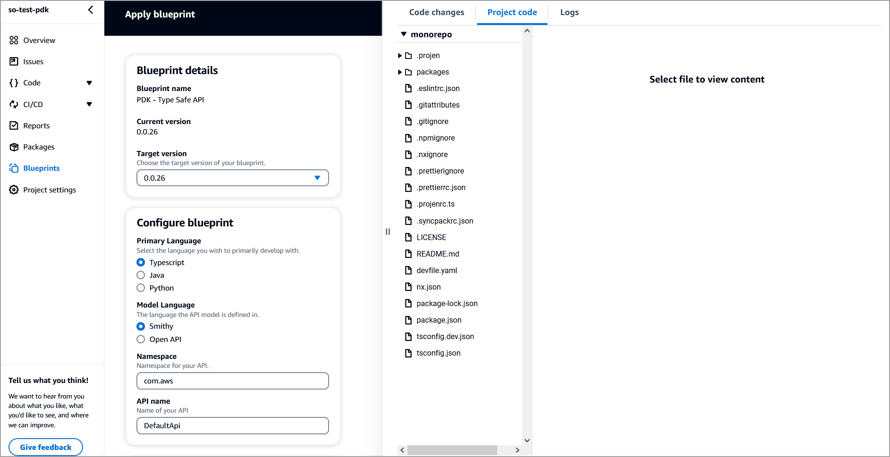

# About this blueprint

This blueprint creates a type-safe API using constructs from the AWS Project Development Kit ([AWS PDK](https://aws.github.io/aws-pdk/)), and provides:

- a mechanism which allows you to define an API using either Smithy or OpenAPI v3, and
- a construct which manages deploying this API in an API Gateway.

Using Smithy or OpenAPI V3 allows you to use features such as generated client and server types, infrastructure, documentation, and automatic input validation.

## How does it work?

This blueprint generates runtime projects from your API definition, which include clients for interacting with your API, and server-side code for implementing your API. The blueprint also generates a type-safe CDK construct with an integration for every API operation.

You can apply (or stack on) this blueprint to an existing PDK Monorepo project for extending the API capabilities of a project.

## Prerequisites

Ensure that you have set up a PDK Monorepo project.

## Set up the blueprint

1. From the Projects page, select **PDK - Monorepo**. The monorepo project summary page displays.
2. On the page, from the left, select **Blueprints**.
3. On the Blueprints page, click **Apply blueprint**. The Apply blueprint page displays.
4. From the CodeCatalyst blueprints page, select **PDK - Type Safe API** and click **Next**.

5. Complete the following:
    - Select the **target version** for your blueprint. You can select a specific version from the dropdown.
    - Select the **primary language** you want to develop your project code in. You can select from Typescript, Java, or Python.
    - Select the **model language** for your API model. You can select from Smithy or OpenAPI.
    - Enter a **namespace** for your API. A namespace is a way to group services for an application.
    - Enter a **name** for your API.
    
6. Click **Apply blueprint** to apply the Type Safe API blueprint to your monorepo project. A new `packages/api` folder is created within your monorepo project which contains all of the API related source code for your configured Type Safe API.

## Project resources

This blueprint creates the following key files as part of your project.

```text
.projen/
    files.json
    tasks.json
generated/
    documentation/ - generated documentation in formats you specified
        html2
        html_redoc
        plantuml
        markdown
    infrastructure/ - generated infrastructure (you'll find only one directory in here based on your chosen infrastructure language)
        typescript
        python
        java 
    libraries/ - generated libraries if specified             
        typescript-react-query-hooks
    runtime/ - generated types, client, and server code in the languages you specified
        typescript
        python
        java
handlers/
    typescript - lambda handlers for operations you choose to implement in TypeScript
    python - lambda handlers for operations you choose to implement in Python
    java - lambda handlers for operations you choose to implement in Java
model/
    src/
        main/
            smithy - API definition if you chose ModelLanguage.SMITHY
            openapi - API definition if you chose ModelLanguage.OPENAPI
```

## Additional resources

For additional information about using type-safe API, refer to the [PDK Developer Guide](https://aws.github.io/aws-pdk/developer_guides/type-safe-api/index.html).